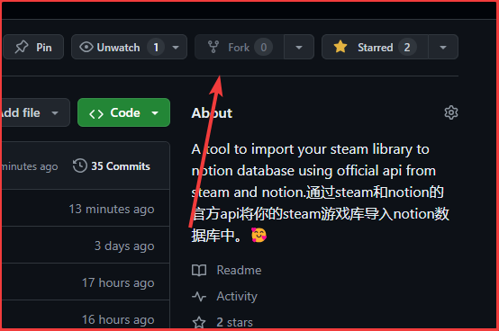

# notion_steam_game_list

语言: [English](./README.md)/中文

## 描述

该项目通过steamapi可以将指定用户的steam公开游戏库数据导入指定notion数据库中，并且可以通过Github Action实现自动化部署更新你的数据库。

表格样式如图：


导入的数据如下：

| 名字         | 数据类型 |
| ------------ | -------- |
| 游戏名       | title    |
| 游玩时长(h)  | number   |
| 上次游玩日期 | date     |
| 商店链接     | url      |
| 游戏logo     | image    |
| 游戏封面     | image    |
| 完成度       | number   |
| 已完成成就数 | number   |
| 总计成就数   | number   |

## 用Github Action实现自动化

### fork该仓库到你的账号下

在页面点击fork即可：



### 配置github action所用的变量

github action中所用到了如下变量：

```yaml
        env:
          STEAM_API_KEY: ${{ secrets.STEAM_API_KEY }}
          STEAM_USER_ID: ${{ secrets.STEAM_USER_ID }}
          NOTION_DATABASE_API_KEY: ${{ secrets.NOTION_API_KEY }}
          NOTION_DATABASE_ID: ${{ secrets.NOTION_DATABASE_ID }}
          #OPTIONAL
          include_played_free_games: ${{secrets.include_played_free_games}}
          enable_item_update: ${{secrets.enable_item_update}}
          enable_filter: ${{secrets.enable_filter}}
          CREATE_DATABASE: ${{secrets.CREATE_DATABASE}}
          PAGE_ID: ${{ secrets.PAGE_ID }}
```

| 名称                      | 数据类型 | 描述                                                            |
| ------------------------- | -------- | --------------------------------------------------------------- |
| STEAM_API_KEY             | string   | steamapi密钥                                                    |
| STEAM_USER_ID             | string   | 要查询用户的steamid                                             |
| NOTION_DATABASE_API_KEY   | string   | notionapi密钥                                                   |
| NOTION_DATABASE_ID        | string   | 你需要修改的notion数据库id                                      |
| include_played_free_games | string   | 是否包含免费游戏                                                |
| enable_item_update        | string   | 是否包含项目更新                                                |
| enable_filter             | string   | 是否包含过滤器                                                  |
| CREATE_DATABASE           | string   | 是否创建新数据库（设定为‘true’则会忽略NOTION_DATABASE_ID）    |
| PAGE_ID                   | string   | 创建新数据库所在的页面id（CREATE_DATABASE设定为‘true‘时生效） |

详细的获取方法和变量功能在本地部署章节中有详细说明，这里不再赘述。

在你forked过去的仓库页面，点击settings->Secrets and Variables->Actions->New repository screct，添加以上变量即可。注意:include_played_free_games,enable_item_update,enable_filter,CREATE_DATABASE这四个变量需要填入true或者false。


### 完成！

配置好之后，GitHub Actions应该就可以正常生效了，我写的配置是在每天UTC时间12点更新数据库，你也可以在main.yal文件中修改配置。你也可以手动触发进行测试，点击Actions->Update Notion with Steam Data->Run workflow，则可以手动触发运行！


## 本地部署

### 修改程序内的配置参数

配置main.py里面的配置参数，里面包含的参数如下：

```python
# CONFIG
STEAM_API_KEY = os.environ.get("STEAM_API_KEY")
STEAM_USER_ID = os.environ.get("STEAM_USER_ID")
NOTION_DATABASE_API_KEY = os.environ.get("NOTION_DATABASE_API_KEY")
NOTION_DATABASE_ID = "63b4fd39830b4946b1c91d65b90a7848"
# OPTIONAL
include_played_free_games = True
enable_item_update = False
enable_filter = True
# related to is_record() function to not record some games based on certain rules
CREATE_DATABASE = False
PAGE_ID = "a6c344eee16c46909f7525601282cdbb"
```

你需要将这里的配置改成你自己的密钥

配置好的应该是类似这样的：

```python
# CONFIG
STEAM_API_KEY = 'xxxx'
STEAM_USER_ID = 'xxxx'
NOTION_DATABASE_API_KEY = 'xxxx'
NOTION_DATABASE_ID = "xxxx"
# OPTIONAL
include_played_free_games = 'true'
enable_item_update = 'false'
enable_filter = 'true'
CREATE_DATABASE = 'false'
PAGE_ID = "xxxx'
```

配置说明如下：

#### STEAM_API_KEY

在steam官网申请获得 https://steamcommunity.com/dev/apikey

#### STEAM_USER_ID

你要查询的steam用户的id，从该用户的永久主页链接获得，格式大概如下：

https://steamcommunity.com/profiles/{STEAM_USER_ID}

#### NOTION_DATABASE_API_KEY

NOTION应用整合的apikey，你需要在notion中创建connection，并将你需要导入的页面连接到这个connection中。

你可以参考[Build your first integration (notion.com)](https://developers.notion.com/docs/create-a-notion-integration)中的“getting start”章节，其中的“API secret”就是这里的NOTION_DATABASE_API_KEY。

#### NOTION_DATABASE_ID

你要导入的数据库id，在导入前你需要确保该页面已经加入上一步创建的connection中。

数据库的行列需要严格包含以下项目，括号内为项目的数据类型：

- name(title)
- playtime(number)
- last play(date)
- store url(url)

数据库的id获取方法如下：

将该数据库单独打开为一个页面，点击share-copy link，分享链接应该是以下格式：

https://www.notion.so/{workspacename}/{database_id}?v={viewID}

这里的{database_id}就是我们需要的数据库id。

程序也提供了一个CREATE_DATABASE的配置选项来创建数据库，如果配置了CREATE_DATABASE = TRUE，那么程序会在指定的页面创建一个新的数据库，并将steam游戏库数据导入这个数据库中，这样就不需要配置NOTION_DATABASE_ID选项。

但是要使用这个功能需要配置PAGE_ID选项，指定程序生成数据库的页面位置。

#### include_played_free_games（OPTIONAL）

是否包含免费游戏

#### enable_item_update（OPTIONAL）

设定为True，程序在数据库中遇到已经添加的项目，会更新该项目。

设定为False，则跳过该项目。

#### enable_filter（OPTIONAL）

是否应用is_record()函数的规则来过滤加入的游戏，你也可以自行修改。

#### CREATE_DATABASE（OPTIONAL）

是否创建新数据库，使用该选项需要配置PAGE_ID项目。

如果设定为True的话，程序则会把游戏数据导入到这个新创建的数据库中，忽略{NOTION_DATABASE_ID}配置项。

如果要使用该配置，需要配置{PAGE_ID}项，指定要创建的数据库所在的页面。

#### PAGE_ID（OPTIONAL）

当CREATE_DATABASE设定为False时会忽略这个选项。

获取方式和数据库id类似，将页面单独打开一个页面，点击share-copy link，分享链接格式如下：

https://www.notion.so/{WORKSPACE}/{PAGE_TITLE}-{PAGE_ID}

'-'后面的则是页面id。

### 安装requests库

假设你的电脑已经在官网下好了python环境。

如果没有的话，请到[python官网](http://www.python.org)安装python 3.6+版本。

```shell
pip install requests
```

### 运行程序

```
python main.py
```
